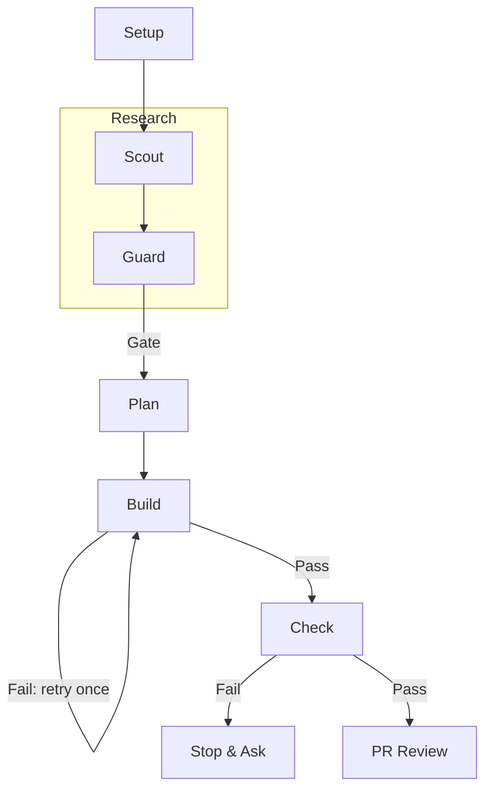

<p align="center">
  <a href="LICENSE"></a>
  <a href="https://conventionalcommits.org"></a>
  <a href="https://github.com/DavidAnson/markdownlint"></a>
</p>

<h1 align="center">agentic-coder-skill</h1>

<p align="center">A production Scout/Guard orchestration skill for AI coding agents.</p>

This is the `coder` skill: an orchestration layer that runs coding tasks through a
research-then-build pipeline with an adversarial review gate, delegating each phase to a
purpose-built subagent instead of doing the work inline. It has been in daily production
use since v1.0.0; this repo is the skill at its current version, with real commit
history, not a point-in-time snapshot.

Background: [Orchestrating AI Agents: A Subagent
Architecture](https://clouatre.ca/posts/orchestrating-ai-agents-subagent-architecture)
and [The AI SDLC Governance
Stack](https://clouatre.ca/posts/ai-sdlc-governance-stack) on clouatre.ca.
Model-selection methodology behind SCOUT/GUARD's swaps over time is documented in
[llm-agent-experiments](https://github.com/clouatre-labs/llm-agent-experiments) (its own
README predates the model pins in `tools/agents/*.yaml`); the predecessor study of
this Scout/Guard architecture is
[prompt-repetition-experiments](https://github.com/clouatre-labs/prompt-repetition-experiments).

## Pipeline



*Figure 1: Scout/Guard/Build/Check pipeline for a complex-tier change; simple and
medium tiers skip delegates or skip GUARD/CHECK entirely (see below).*

The orchestrator classifies every change into one of three tiers (simple, medium,
complex) and scales the pipeline accordingly — a one-line config change skips every
delegate, while an architectural change runs the full SCOUT + GUARD + BUILD + CHECK
chain. Full phase-by-phase detail, including the constraints each delegate operates
under, lives in [`skills/coder/SKILL.md`](skills/coder/SKILL.md) — that file is the spec
and the changelog, not just an entry point.

| Phase | Role |
|---|---|
| SCOUT | Read-only research: relevant files, conventions, candidate approaches |
| GUARD | Read-only adversarial review of Scout's findings: risk, blast radius, safety ranking |
| PLAN | Orchestrator-authored implementation plan, synthesizing Scout + Guard |
| BUILD | Implements the plan, runs tests/lint/format |
| CHECK | Validates the diff against the plan; on PASS, commits and opens a draft PR |

## What's here

| Path | Description |
|---|---|
| `skills/coder/SKILL.md` | The skill itself — entry point, phase spec, and version history |
| `skills/coder/SKILL.md` | The skill itself — entry point, phase spec, and version history |
| `agents-shared/coder-*.md` | Shared agent bodies (harness-agnostic), the edit source |
| `tools/agents/{pi,claude}-coder-*.yaml` | Per-harness frontmatter: model, tools, effort |
| `agents/{pi,claude}/coder-*.md` | Generated agent files (frontmatter + body) — do not hand-edit |
| `scripts/generate-coder-agents.sh` | Regenerates/validates the agent files (`--write` / `--check`) |
| `githooks/` | Local governance hooks: conventional commits, DCO sign-off, protected-branch enforcement, branch hygiene |

## One pipeline, three harnesses

`skills/coder/SKILL.md` is the single pipeline definition, consumed by pi, Claude
Code, and Goose (skill/workflow format); Codex is compatible. The four coder
subagents are defined once and rendered per harness:

1. **Edit the sources**: `tools/agents/{pi,claude}-coder-<role>.yaml` holds the
   harness frontmatter (model, tools, thinking, max_turns); `agents-shared/coder-<role>.md`
   holds the harness-agnostic body.
2. **Regenerate**: `scripts/generate-coder-agents.sh --write` concatenates
   frontmatter + body into `agents/pi/coder-<role>.md` and `agents/claude/coder-<role>.md`.
3. **Validate**: `scripts/generate-coder-agents.sh --check` exits 1 on drift; CI runs
   it on every PR.

Goose recipes are retired: Goose consumes `SKILL.md` directly as a workflow.

## Githooks

Install with:

```bash
git config core.hooksPath githooks
```

- `commit-msg` — Conventional Commits format, DCO sign-off, no `Co-authored-by:` trailers
- `pre-commit` — blocks direct commits to `main`/`master`/`release/*`; verifies the
  committer's signing key against a `~/.gitconfig-*`-per-identity convention (adapt this
  check to your own identity-management setup, or drop it, if you don't use that
  convention)
- `pre-push` — blocks direct pushes to protected branches
- `post-checkout` — prunes local branches whose remote tracking branch is gone, on
  checkout to `main`/`master`

These are the same conventions `coder-check`'s commit/PR step assumes are in place.

## License

[Apache 2.0](LICENSE)
