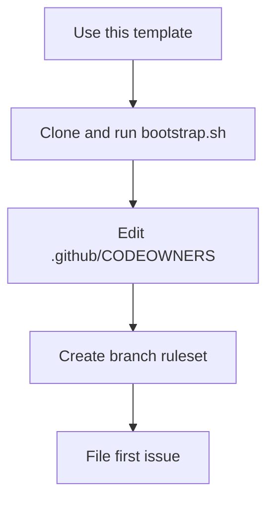
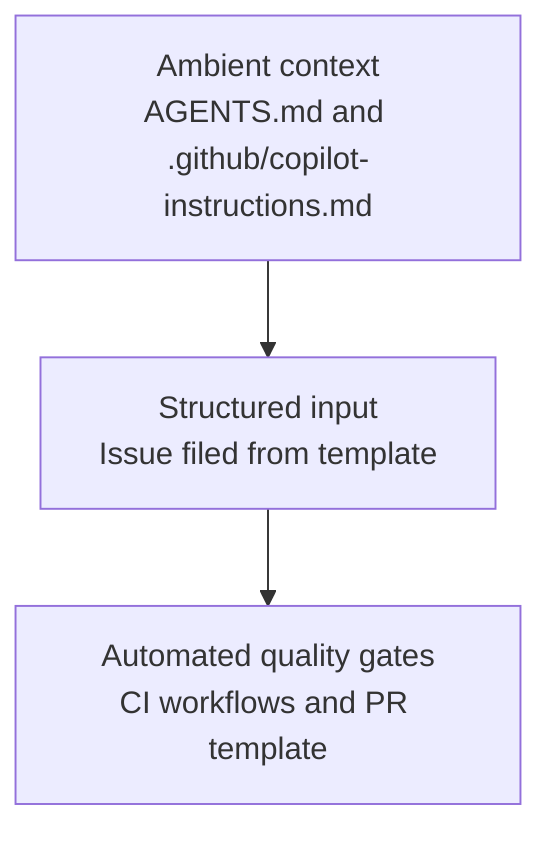

<p align="center">
  <a href="https://conventionalcommits.org"></a>
  <a href="https://docs.github.com/en/repositories/creating-and-managing-repositories/creating-a-repository-from-a-template"></a>
  <a href="https://github.com/DavidAnson/markdownlint"></a>
</p>

<h1 align="center">template-repo</h1>

A GitHub repository template for personal and OSS repos under clouatre-labs.
It bundles security workflows, CI enforcement, AI agent tooling scaffolding, issue templates, a PR template, labels, branch ruleset instructions, and contribution guidelines.
Clone it once to get a consistent, hardened starting point for any engagement.

## Using This Template

1. Navigate to [github.com/clouatre-labs/template-repo](https://github.com/clouatre-labs/template-repo).
2. Click **Use this template** > **Create a new repository**.
3. Fill in the owner, name, and visibility for the new repo.
4. Work through the post-clone checklist below.

## Post-Clone Checklist

1. Clone the new repo locally.
2. Run the bootstrap script to create standard labels:

   ```bash
   bash scripts/bootstrap.sh
   ```

3. Edit `.github/CODEOWNERS` and replace `@clouatre` with the actual GitHub account or team.
4. Update the absolute contact URLs in `.github/ISSUE_TEMPLATE/config.yml` to point to the new repository.
5. Complete the project-specific placeholders in `AGENTS.md` and `.github/instructions/`.
   Commit and push these changes.
6. Create the branch protection ruleset using the `gh api` command printed by `bootstrap.sh`
   (requires repo admin access).
7. Enable required status checks in the ruleset: `CI Result`, `Security Result`, and `Lint markdown`.
8. Add repository topics that describe the engagement or project (GitHub UI or `gh repo edit --add-topic`).



*Figure 1: Post-clone setup: five steps from template to first issue.*

## What's Included

| Artifact | Description |
|---|---|
| `.github/workflows/ci.yml` | Commit-message lint (commitlint) and branch-base check, gated behind a `CI Result` aggregate status check |
| `.github/workflows/security.yml` | TruffleHog secret scan, zizmor SHA-pin check |
| `.github/workflows/scheduled-security-audit.yml` | Weekly scheduled zizmor security audit |
| `.github/workflows/markdown-lint.yml` | markdownlint-cli2 on docs and markdown source |
| `.github/dependabot.yml` | Weekly action updates grouped as one PR |
| `.commitlintrc.yml` | Conventional Commits enforcement configuration for commitlint |
| `.github/zizmor.yml` | zizmor configuration (suppresses `dependabot-cooldown` false positive) |
| `.github/workflows/scorecard.yml` | Weekly OpenSSF Scorecard analysis; uploads SARIF to code scanning |
| `.github/workflows/scorecard-publish.yml` | Monthly scorecard.dev publishing via amd64 exception |
| `.github/CODEOWNERS` | Placeholder routing all reviews to a team |
| `.github/copilot-instructions.md` | GitHub Copilot workspace instructions and checklist for the Copilot coding agent |
| `.github/instructions/src.instructions.md` | Example scoped instructions file for source-file conventions under `src/**/*` (coding agent excluded) |
| `.github/ISSUE_TEMPLATE/` | Bug, documentation, feature, refactor templates |
| `.github/PULL_REQUEST_TEMPLATE.md` | PR checklist |
| `AGENTS.md` | AI agent scaffold: role, constraints, stack commands, and development standards for coding agents (goose, Claude Code, Copilot) |
| `tools/agentsmd/global-reference.md` | Reference global AGENTS.md covering communication style, tooling conventions, commit standards, and agentic workflow patterns; seed for `~/.config/goose/AGENTS.md` (goose) or `~/.claude/CLAUDE.md` (Claude Code) |
| `CONTRIBUTING.md` | Conventional commits, GPG+DCO sign-off, branch model |
| `SECURITY.md` | Vulnerability disclosure policy |
| `docs/REPO-STANDARDS.md` | Full explanation of every security control |
| `scripts/bootstrap.sh` | Idempotent label creation and ruleset instructions |

*Table 1: Artifacts included in the template and their purpose.*

## AI-Assisted Development

Every artifact in this template doubles as structured context for AI coding agents. A well-filled issue can be assigned directly to an agent (GitHub Copilot, [goose](https://github.com/aaif-goose/goose), Claude Code) to produce a scoped, reviewable PR without additional prompting; this is sometimes called context engineering.

The template organizes context into three layers:



*Figure 2: Three-layer context model for AI-assisted development.*

| Layer | Artifacts | What the agent receives |
| --- | --- | --- |
| Ambient context | `AGENTS.md`, `.github/copilot-instructions.md`, `.github/instructions/` | Project overview, stack commands, conventions, and hard constraints; loaded before the agent writes a single line |
| Structured inputs | `.github/ISSUE_TEMPLATE/` | Problem statement, acceptance criteria, reproduction steps, and scope boundaries |
| Output quality gates | CI workflows, `.github/PULL_REQUEST_TEMPLATE.md`, `.commitlintrc.yml` | Automated checks that catch agent errors (bad commits, exposed secrets, scope drift) before review |

*Table 2: Three-layer context model: what each layer provides to the coding agent.*

To use the template with an AI coding agent:

1. File an issue using one of the templates and fill every section.
2. Assign the issue to your agent (e.g. `gh issue edit <NUMBER> --add-assignee copilot-swe-agent`).
3. Review the resulting PR against the acceptance criteria in the original issue.

## DOCX Generation

```sh
pandoc -d docx content/delivery/example.md -o content/delivery/example.docx \
  --resource-path=content/delivery
```

If global pandoc defaults are not installed (`~/.local/share/pandoc/`), use project-local:

```sh
pandoc -d tools/pandoc/defaults.yaml content/delivery/example.md -o content/delivery/example.docx \
  --resource-path=content/delivery
```

- `tools/pandoc/defaults.yaml` bundles the reference document and Lua filter for automatic table styling
- `tools/pandoc/docx-table.lua` applies the BorderedTable style to all tables
- BorderedTable style in `reference.docx` includes borders, auto-fit layout, and keep-together properties
- `--resource-path=content/delivery` is required when the markdown embeds images with relative paths
- Commit the DOCX alongside the markdown for delivery documents

Requires [pandoc](https://pandoc.org/).

## Directory Structure

```
template-repo/
  .github/
    ISSUE_TEMPLATE/   # bug, feature, documentation, refactor templates
    workflows/        # ci.yml, security.yml, markdown-lint.yml, scheduled-security-audit.yml, scorecard.yml, scorecard-publish.yml
    CODEOWNERS        # team review enforcement
    dependabot.yml    # weekly action SHA updates
    zizmor.yml        # zizmor false-positive suppressions (now at .github/zizmor.yml)
    PULL_REQUEST_TEMPLATE.md
  content/
    delivery/         # client-facing deliverables (MD + DOCX)
    research/         # approach briefs, assessment trackers
    meetings/         # meeting notes
    emails/           # correspondence drafts
    survey/           # code survey findings
  docs/
    REPO-STANDARDS.md # artifact map and security hardening reference
  tools/
    pandoc/           # defaults.yaml, docx-table.lua, reference.docx
  scripts/
    bootstrap.sh      # seed labels and print ruleset instructions
  CONTRIBUTING.md
  SECURITY.md
```

## Docs

See [docs/REPO-STANDARDS.md](docs/REPO-STANDARDS.md) for a detailed description of every security control and step-by-step onboarding instructions.
