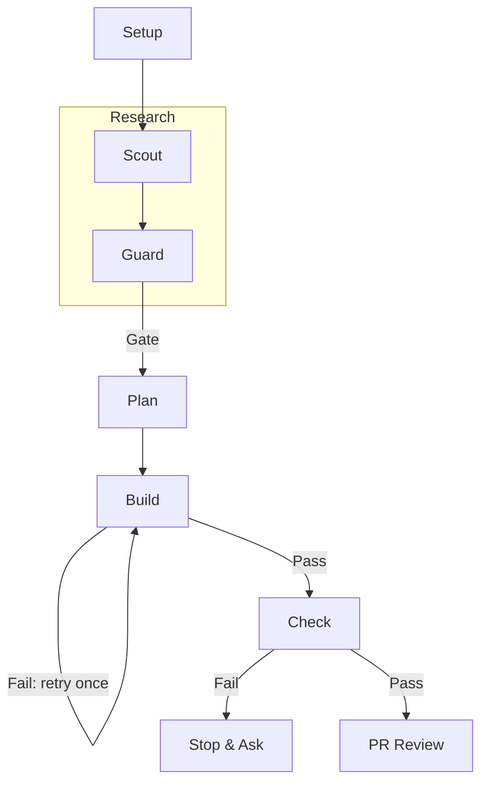
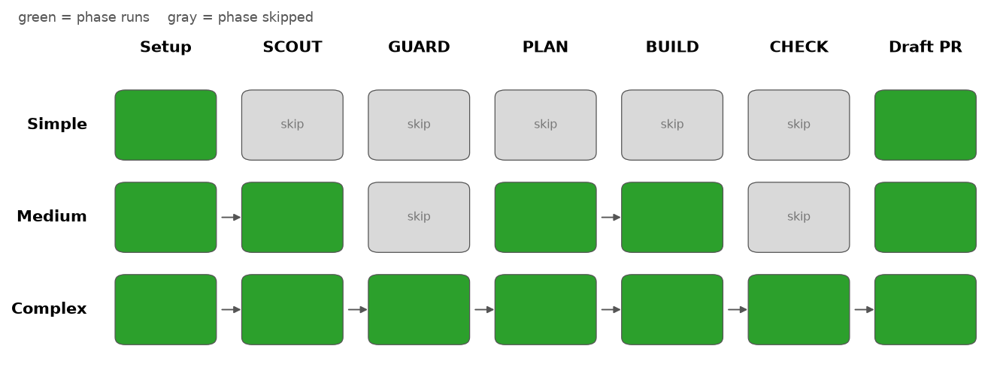
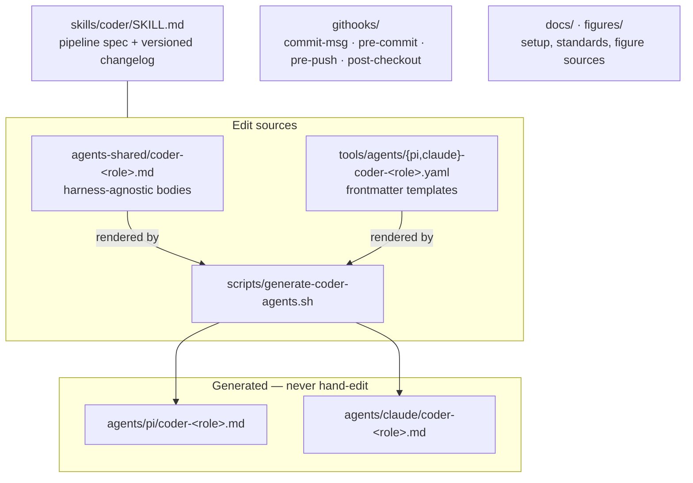
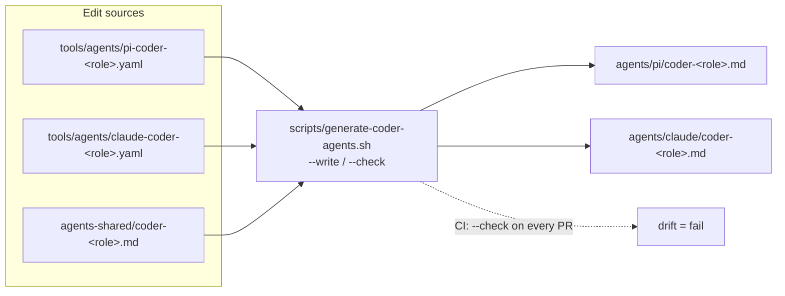
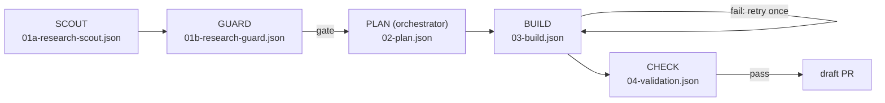

<p align="center">
  <a href="LICENSE"></a>
  <a href="https://conventionalcommits.org"></a>
  <a href="https://github.com/DavidAnson/markdownlint"></a>
</p>

<h1 align="center">agentic-coder-skill</h1>

<p align="center">A production Scout/Guard orchestration skill for AI coding agents.</p>

This is the `coder` skill: an orchestration layer that runs coding tasks through a
research-then-build pipeline with an adversarial review gate, delegating each phase to a
purpose-built subagent instead of doing the work inline. It has been in daily production
use since v1.0.0; this repo is the skill at its current version, with real commit
history, not a point-in-time snapshot.

Background: [Orchestrating AI Agents: A Subagent
Architecture](https://clouatre.ca/posts/orchestrating-ai-agents-subagent-architecture)
and [The AI SDLC Governance
Stack](https://clouatre.ca/posts/ai-sdlc-governance-stack) on clouatre.ca.
Model-selection methodology behind SCOUT/GUARD's swaps over time is documented in
[llm-agent-experiments](https://github.com/clouatre-labs/llm-agent-experiments) (its own
README predates the model pins in `tools/agents/*.yaml`); the predecessor study of
this Scout/Guard architecture is
[prompt-repetition-experiments](https://github.com/clouatre-labs/prompt-repetition-experiments).

## Pipeline



*Figure 1: Scout/Guard/Build/Check pipeline for a complex-tier change; simple and
medium tiers skip delegates or skip GUARD/CHECK entirely (see below).*

The orchestrator classifies every change into one of three tiers and scales the
pipeline accordingly — a one-line config change skips every delegate, while an
architectural change runs the full SCOUT + GUARD + BUILD + CHECK chain. Full
phase-by-phase detail, including the constraints each delegate operates under, lives in
[`skills/coder/SKILL.md`](skills/coder/SKILL.md) — that file is the spec and the
changelog, not just an entry point.

*Table 1: Tier classification. Uncertainty resolves to the higher tier. Each
change is classified by ONE `typesafe-judge` Choice question (the judge is
required on PATH — its absence is a STOP, never an inline fallback), with two
deterministic pre-filters for trivially Simple changes (explicit issue label +
single file + small self-declared diff; `issue_text` viability guard). Every
classification appends a JSONL log line — no log line, no session.*

| Tier | Typical change (SKILL.md Constraint #2) | Pipeline |
|---|---|---|
| Simple | Config, docs, CI, single-file < 50 lines, no cross-repo research | Inline, no delegates; test/lint/format before commit |
| Medium | Multi-file docs, cross-repo reference, well-understood patterns, no new abstractions | SCOUT → PLAN → BUILD (no GUARD, no CHECK) |
| Complex | Architectural decisions, new abstractions, multi-file code > 50 lines, security-sensitive | SCOUT → GUARD → PLAN → BUILD → CHECK |



*Figure 2: Phase execution per tier (data: SKILL.md Constraint #2). For the Simple
tier, implementation and PR are inline — no delegate runs; the regenerate script
is [`figures/fig-tier-pipeline.py`](figures/fig-tier-pipeline.py).*

*Table 2: Pipeline phases, the four subagents, and their model pins (sources:
`tools/agents/{pi,claude}-coder-*.yaml`). PLAN is authored by the orchestrator,
whose model is whatever the host session runs — this repo pins only the four
delegates.*

| Phase | Delegate | Model (pi / Claude Code) | Responsibility |
|---|---|---|---|
| SCOUT | `coder-scout` | `zai/glm-5.3-flash` / `haiku` | Read-only research: relevant files, conventions, 2–3 candidate approaches |
| GUARD | `coder-guard` | `zai/glm-5.3-flash` / `haiku` | Adversarial review of Scout's output: risk, blast radius, safety ranking |
| PLAN | orchestrator | session model (not pinned here) | Implementation plan synthesizing Scout + Guard |
| BUILD | `coder-build` | `zai/glm-5.3-flash` / `sonnet` | Implements the plan, runs test/lint/format. Large plans shard deterministically into parallel worktree-isolated shards, each gated on shard-scoped test/lint (never the judge); only passing shards merge, and CHECK then validates the merged diff once |
| CHECK | `coder-check` | `zai/glm-5.3-flash` / `haiku` | Validates the diff against the plan; on PASS, commits and opens a draft PR |

## What's here

*Table 3: Repository layout — edit the sources, never the generated files.*

| Path | Description |
|---|---|
| `skills/coder/SKILL.md` | The skill itself — entry point, phase spec, and version history |
| `agents-shared/coder-*.md` | Shared agent bodies (harness-agnostic), the edit source |
| `tools/agents/{pi,claude}-coder-*.yaml` | Per-harness frontmatter templates: model, tools, effort |
| `agents/{pi,claude}/coder-*.md` | Generated agent files (frontmatter + body) — do not hand-edit |
| `scripts/generate-coder-agents.sh` | Regenerates/validates the agent files (`--write` / `--check`) |
| `githooks/` | Local governance hooks: conventional commits, DCO sign-off, protected-branch enforcement, branch hygiene |



*Figure 3: Project structure. Edit sources (top) are rendered into the generated
agent files (bottom); the generation mechanics are detailed in Figure 4.*

## One pipeline, four harnesses

`skills/coder/SKILL.md` is the single pipeline definition. Its frontmatter declares
compatibility with four harnesses: **pi**, **Claude Code**, **Codex**, and **Goose**
(Goose consumes `SKILL.md` directly as a workflow; the dedicated recipe format was
retired in v3.13.0).

The four coder subagents are defined once and rendered per harness:

1. **Edit the sources**: `tools/agents/{pi,claude}-coder-<role>.yaml` holds the
   harness frontmatter (model, tools, thinking, max_turns); `agents-shared/coder-<role>.md`
   holds the harness-agnostic body.
2. **Regenerate**: `scripts/generate-coder-agents.sh --write` concatenates
   frontmatter + body into `agents/pi/coder-<role>.md` and `agents/claude/coder-<role>.md`.
3. **Validate**: `scripts/generate-coder-agents.sh --check` exits 1 on drift; CI runs
   it on every PR.



*Figure 4: Agent generation — one shared body, two frontmatter templates, two
generated agent files per role; 4 roles × 2 harnesses = 8 generated files, never
hand-edited.*

## typesafe-ai integration

Since v3.13.0 the pipeline uses TypeSafe System One judgments
(the `jev` model, served at `api.typesafe.ai`) in two places, with deterministic inline fallback
on any API failure — the pipeline never blocks on the judge:

- **Tier classification** (Table 1): ONE Choice question over the three tiers — a
  bounded enum decision, not per-tier prose judgment. The selected option is the
  tier; confidence < 0.6 escalates one tier. Verdicts are logged as one JSONL line
  per session at `${DOTFILES:-$HOME/.local/state}/var/coder-log/<host>.jsonl`.
- **Handoff degeneracy gate**: free-text fields in the five JSON handoff files are
  checked with a gzip compression-ratio test; ambiguous gray-zone ratios
  (0.10–0.25) get ONE score question ("how padded/repetitive?"), batched into a
  single `--manifest` call per handoff (≤ 8 in-flight); a "padded" verdict acts
  only at p ≥ 0.8. Each validation also logs one JSONL line (`status`, `ratio`).
  Both judgment types are small, bounded, threshold-gated decisions composed by
  deterministic code — cheap in tokens and verifiable after the fact.

All judgments transit `api.typesafe.ai`, a third-party service; the `TYPESAFE_AI_TOKEN`
environment variable is inherited via the shell and is never written to files or
handoffs. The `typesafe-judge` helper script itself is external to this repo — this
repo documents only its contract (see [`skills/coder/SKILL.md`](skills/coder/SKILL.md),
Constraints #9–#10 and Handoff Validation).

## Handoff protocol

Every phase boundary is a JSON file on disk — no context is passed through chat
memory. The orchestrator writes, each delegate reads its predecessor's file and
writes its own:

*Table 4: The five handoff files. A missing handoff is fatal: the orchestrator
stops and reports — it never works inline as a fallback.*

| Handoff | Written by | Read by |
|---|---|---|
| `01a-research-scout.json` | SCOUT | GUARD, orchestrator |
| `01b-research-guard.json` | GUARD | orchestrator |
| `02-plan.json` | orchestrator (PLAN) | BUILD |
| `03-build.json` | BUILD | CHECK, orchestrator |
| `04-validation.json` | CHECK | BUILD (on retry), orchestrator |

All files are written compact (`jq -c .`) and stored under
`<git-common-dir>/coder-handoffs/<session-id>/`, outside the session worktree so
worktree teardown cannot destroy them. Every free-text field is validated on read
with a gzip compression-ratio degeneracy check (see typesafe-ai integration above).

```bash
# A reader never trusts a handoff blindly: structure, then degeneracy
f="$HANDOFF/01a-research-scout.json"
jq empty "$f"                                        # structural validity
raw=$(jq -r .recommendation "$f" | wc -c)            # extract a free-text field
gz=$(jq -r .recommendation "$f" | gzip -9 | wc -c)
awk -v r="$raw" -v z="$gz" 'BEGIN { printf "ratio: %.3f\n", z/r }'
# ratio < 0.10 trips the gate; 0.10-0.25 is the judge-consulted gray zone
```

*Code Snippet 1: Handoff validation as performed between phases (see
`skills/coder/SKILL.md`, Handoff Validation, for the full gate: 200B floor,
Retry Policy, score-mode judge gray zone, per-handoff log line).*



*Figure 5: Handoff data flow across a complex-tier session — each arrow is a JSON
file consumed by the next role, validated on read.*

## Inspecting a session

```bash
# List sessions and peek at each plan's overview
for d in "$(git rev-parse --path-format=absolute --git-common-dir)"/coder-handoffs/*/; do
  printf '%s: ' "$(basename "$d")"; jq -r .overview "$d/02-plan.json"
done

# Verify generated agents match their sources (what CI runs)
scripts/generate-coder-agents.sh --check

# Current skill version
grep '^version:' skills/coder/SKILL.md
```

*Code Snippet 2: Common inspection commands. Handoffs live outside the worktree, so
they survive worktree teardown and are visible from any checkout.*

For a real end-to-end run — five issues, five parallel sessions, five merged PRs,
three human interventions — see
[docs/examples/2026-09-aptu-coder-5-issues.md](docs/examples/2026-09-aptu-coder-5-issues.md),

## Githooks

Install with:

```bash
git config core.hooksPath githooks
```

- `commit-msg` — Conventional Commits format, DCO sign-off, no `Co-authored-by:` trailers
- `pre-commit` — blocks direct commits to `main`/`master`/`release/*`; verifies the
  committer's signing key against a `~/.gitconfig-*`-per-identity convention (adapt this
  check to your own identity-management setup, or drop it, if you don't use that
  convention)
- `pre-push` — blocks direct pushes to protected branches
- `post-checkout` — prunes local branches whose remote tracking branch is gone, on
  checkout to `main`/`master`

These are the same conventions `coder-check`'s commit/PR step assumes are in place.

## Tooling

*Table 5: Tooling requirements. Pipeline rows are runtime dependencies of a
coder session; BUILD rows run only when the change touches that language; repo
CI rows run on pull requests to `main`. Figures are regenerated with matplotlib
via `figures/fig-tier-pipeline.py`.*

| Tool | Scope | Used for |
|---|---|---|
| git 2.40+ | pipeline | worktrees, githooks, handoff storage under the common git dir |
| jq | pipeline | all handoff read/write (`jq -c .` compact form) |
| gzip | pipeline | handoff degeneracy gate (`gzip -9` compression ratio) |
| `gh` CLI | pipeline | issue/PR operations (Rule 3; PR creation is CHECK-only) |
| `typesafe-judge` | pipeline | tier classification + degeneracy gate (Choice/score questions); external script, contract in SKILL.md |
| uv, ruff, pyright | BUILD (Python) | test/lint/typecheck per SKILL.md Tooling Reference |
| bun or pnpm, biome, vitest | BUILD (JS/TS) | test/lint/format per SKILL.md Tooling Reference |
| cargo, clippy, cargo-deny | BUILD (Rust) | build/test/lint/deny per SKILL.md Tooling Reference |
| markdownlint-cli2 | repo CI + local | CI via the markdownlint-cli2 GitHub Action on PRs; locally via `bunx markdownlint-cli2 "**/*.md"` |
| shellcheck | local | githooks lint (recommended, not enforced in CI) |

## License

[Apache 2.0](LICENSE)
