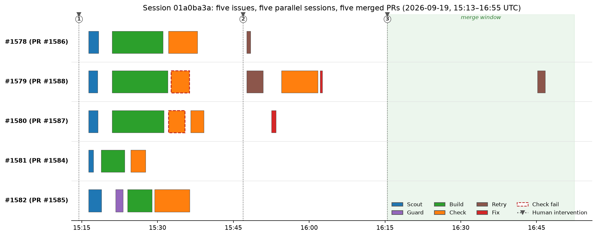

# Case Study: Five Refactoring Issues, One Orchestrated Run

On 2026-09-19, the `coder` skill (v3.x, Scout/Guard architecture) processed five GitHub
refactoring issues (1578–1582) against `clouatre-labs/aptu-coder` (Rust workspace) in a
single orchestrated run. The orchestrator classified all five via `typesafe-judge`, ran
five parallel single-issue sessions with per-session worktrees and handoff directories,
and produced PRs #1584–#1588: all approved by an external LLM review gate, CI green,
squash-merged in dependency order. Total wall clock: 15:12:50–16:55:21 UTC (~1h42m),
16 subagent spawns, 3 human interventions — all approvals/steering, zero rescues. Net
result was a reduction in lines of code.

## The task

Five related refactoring issues in the same repository, batched into one request:

| Issue | Scope (as classified) |
|-------|----------------------|
| #1578 | refactoring, medium |
| #1579 | refactoring, medium |
| #1580 | refactoring, medium |
| #1581 | refactoring, medium |
| #1582 | refactoring, complex |

The batch raised an orchestration question: run all five through one session with
parallel BUILD, or isolate each issue? The orchestrator recommended five parallel
single-issue sessions — one worktree plus one handoff directory per session — so each
PR stays independently reviewable and revertible. The user approved.

## How the pipeline ran

Phase 0 SETUP created five session IDs, worktrees, and handoff dirs under the shared
`.git/coder-handoffs/<session-id>/` (surviving worktree removal). Tier classification
ran through `typesafe-judge` per issue, with a mandatory classify JSONL log line per
session.

*Table 1: The five sessions, tiers, phases run, and outcomes*

| Issue | Tier | Phases | Outcome |
|-------|------|--------|---------|
| 1578 | medium | SCOUT -> PLAN -> BUILD -> CHECK+PR | PR #1586, merged (duplicate field dropped) |
| 1579 | medium | SCOUT -> PLAN -> BUILD -> CHECK (fail -> retry) | PR #1588, merged (-99/+3 LOC) |
| 1580 | medium | SCOUT -> PLAN -> BUILD -> CHECK (fail -> retry) | PR #1587, merged (+0.35.0 bump) |
| 1581 | medium | SCOUT -> PLAN -> BUILD -> CHECK+PR | PR #1584, merged (legacy metrics dir deleted) |
| 1582 | complex | SCOUT -> GUARD -> PLAN -> BUILD -> CHECK | PR #1585, merged (shared telemetry preamble) |

Medium tier per the skill's Constraint #2: SCOUT research, orchestrator-authored PLAN,
BUILD delegation, with CHECK run at PR time. Issue 1582 was classified **complex**
(new abstraction: shared telemetry preamble extraction), so it got the full pipeline
including GUARD.

Twenty-two subagent spawns in total — 5 `coder-scout`, 1 `coder-guard`, 12
`coder-build`, 4 `coder-check` — most running in parallel in the background across the five sessions.

*Figure 1: Timeline of the 22 agent spawns (scout/guard/build/check, with retries and fixes)
 across the five parallel sessions, 15:13–16:55 UTC. Dashed markers show the three
 human steering interventions; the shaded band is the merge window.*

## What went right

- **GUARD earned its keep on 1582.** The shared-preamble extraction looked like a
  mechanical unification of seven near-identical code blocks. GUARD flagged that
  "the seven preambles are not fully identical" — a naive merge would have changed
  `exec_command` behavior. The constraint was preserved in the plan and the build.
  This is the difference between refactoring and silent behavior change.
- **Isolation paid off.** Five worktrees and five handoff dirs meant one session's
  CHECK failure never blocked the other four. #1580 could fail and be repaired while
  #1584, #1585, #1587, #1588 moved forward.
- **Net negative LOC.** #1579 (PR #1588) finished at −99/+3. The pipeline removed code rather
  than adding it, which is what a refactoring run should do.

## What went wrong (and self-healed)

These are worth emphasizing: none of them were hidden, and each was surfaced with an
honest attribution.

- **Orchestrator's own setup inconsistency -> CHECK FAIL on #1580.** A branch-name
  mismatch introduced during Phase 0 setup by the orchestrator itself caused coder-check
  to FAIL. The failure was attributed to the orchestrator's setup (not blamed on an
  agent), fixed with branch renames, and the session re-ran CHECK cleanly.
- **#1579: code correct, tests missing -> CHECK FAIL, presented as either/or.**
  coder-check flagged that the change was functionally correct but lacked tests. The
  orchestrator did not silently expand scope; it presented the user an exact either/or
  (add tests vs. accept as-is). Resolved after explicit approval.
- **Rate-limited PR-review gate -> fallback provider.** The external LLM review gate
  hit a rate limit mid-run. A fallback provider was authorized and used, keeping the
  gate substantive rather than skipped.
- **Two semver CI failures.** #1587 and #1588 changed public API surface (an enum
  discriminant and a public struct field), tripping semver checks in CI. Resolved with
  a coordinated `0.35.0` version bump — a legitimate minor-version change, not a
  workaround.
- **Rebase of #1588 after #1587 merged.** The dependency-order merge required one
  rebase of #1588 onto the updated main; clean, no conflict escalation.

## Human involvement

Three interventions total, all approvals or steering — zero rescues (no intervention
was needed to fix something the pipeline had gotten wrong in a way it could not
self-report):

1. Approve the five-parallel-session plan over in-session parallel BUILD.
2. Authorize the fallback provider for the rate-limited review gate; then confirm
   "all PRs ready, CI green" to proceed to merge.
3. Authorize the ordered merge (dependency order 1584 -> 1588, with rebase of #1588).

Everything else — classification, research, guarding, planning, building, checking,
retries — ran without human touch.

## Artifacts

Source artifacts: the raw session transcript (retained locally in the pi session
store) and `figures/fig-session-timeline.py` (regenerates Figure 1).

## Takeaway

The pipeline's value in this run was not that nothing failed — two CHECK FAILs, a rate
limit, a flaky CI test, two semver breaks, and a rebase that initially dropped its
commit all happened. It was that every failure was
detected by a gate (CHECK, GUARD, CI, review gate), attributed honestly, and either
repaired by the Retry Policy or escalated as a precise question to the human. Three
approvals bought five merged, reviewable, revertible refactoring PRs in under two hours.

---
